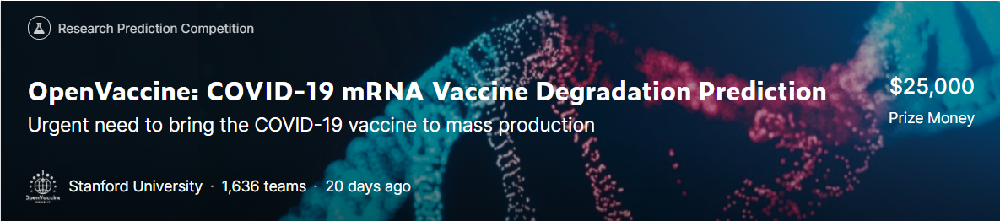

# Covid_vaccin

Scolar projet for Master Bioinformatics at Univerité de Paris 

Based on this Kaggle project : 

https://www.kaggle.com/c/stanford-covid-vaccine

Octobre 2020

    

# Authors : 

Hollier Laetitia : laetitia-hollier@outlook.fr

Messad Dit Mahtal Lynda : lyndamessad96@gmail.com

Rambaud Opale : opale.rambaud@gmail.com

# Prerequisites 

Python 3.7.3

**Modules :** 

- json

- pandas

- numpy 

- plotly

- tensorflow

- sklearn

- keras 

**All available in the Yamal environment (available in this repository)** 

# Clone the repository on your computer: 

git clone  https://github.com/lyndamessad/Covid_vaccin.git 

#  Install the conda env: 

conda env create -f conda_env.yml

# Activate the conda env:

conda activate conda_env

# Run the main script :

Please be sure you have all the data files before running the script 

The main script is in Jupyter Notebook format.

To run the script : 

- launch Jupyter Notebook in a shell with the command : 

`jupyter notebook`

- go in the Covid_vaccin folder 

- run the notebook 

